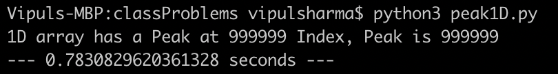
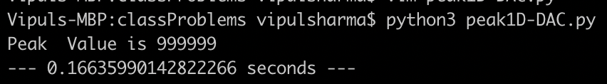

# Class Programs for Lecture 1

Lecture 1 was mainly focused aroung “Peak finding” problem.
Which had two parts : 
- 1D Peak Finder Problem
- 2D Peak Finder Problem

## PEAK FINDER PROBLEM

Find a peak in given set of input if exists where an element is a peak if it is greater then or equal to it's neighbour elements


### Solutions for 1D Peak Finder Problem

- 1 Solution
  - This is a straight forward approach where we are moving from left to right and checking if an element is peak or not.
    
```text
Algorithmic Complexity  
    Θ(n)

Input Size 1000000 :
```


- 2 Solution
  - This is a more efficient solution using Divide and Conquer Approach.

```text
Algorithmic Complexity  
    Θ(log2(n))

Input Size 1000000 :
```



### Solutions for 2D Peak Finder Problem

-   **Greedy Ascent Algorithm** - The Algorithm states that ***" it selects a particular element to start with. Then it begins traversing across the array, by selecting the neighbour with higher value. If there is no neighbour with a higher value than the current element, it just returns the current element.***
    
    * Solution 1 :
    
        * This is the Solution to the 2D Peak finder problem using Greedy Ascent Algorithm. 
        
        &nbsp;
        ``` text        
        Algorithmic Complexity 
            Θ(nm)       where n is number of rows and m is number of columns
                        if number of rows and columns are same then : m=n
            Θ(n^2)
        ```
        &nbsp;
        
    * Solution 2 :
    
        * This is a modification  of the ***Greedy Ascent Algorithm*** where instead of selecting any neighbour element that is greater then the selected element we choose the element that is greatest of all the neighbouring elements of the selected element.
        
        **Better Performance compared with Greedy Ascent Algorithm Solution**
        <br />        
        **Input :**
        
         
        
        <br /> 
        
        **Greedy Ascent Algorithm :**
        
         
        <br />
        
         
        <br /> 
        
        **Greedy Ascent Algorithm Improved Version:**
        
         
        <br /> 
        
         
        <br /> 
